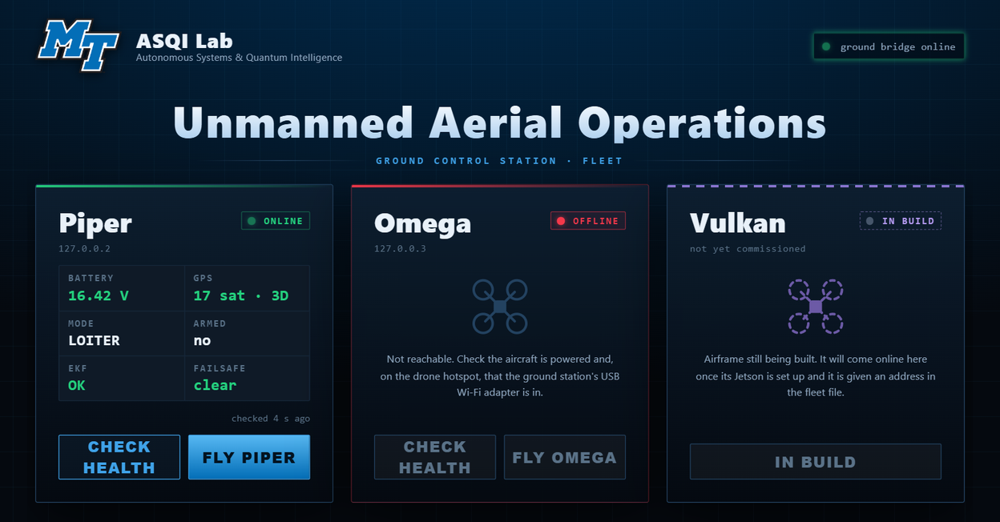
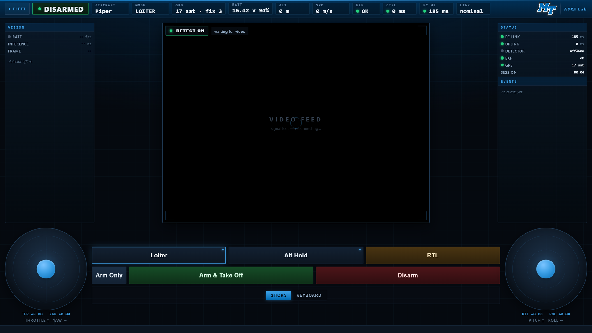
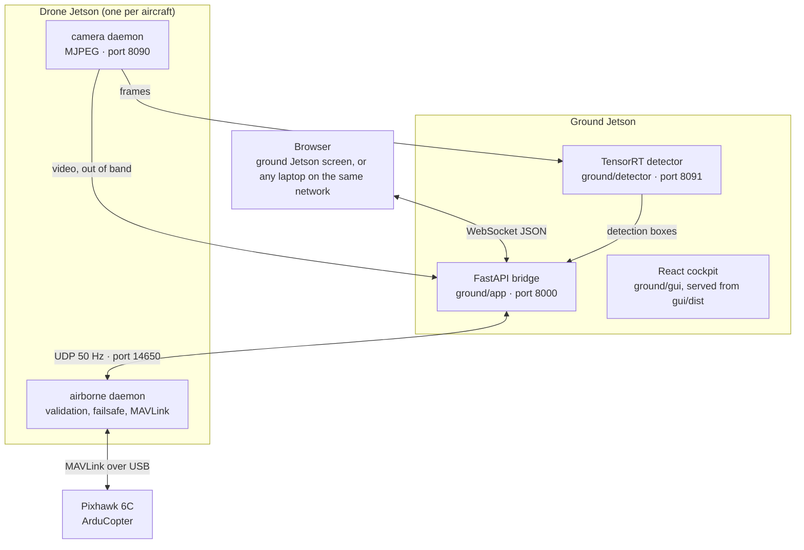

<div align="center">

# ASQI Unmanned Aerial Operations

**A browser-based ground control station for a small fleet of research quadcopters**

MTSU ASQI Lab · Autonomous Systems &amp; Quantum Intelligence Laboratory

<br>



</div>

<br>

An operator opens a web page, picks an aircraft from the fleet, and flies it with
on-screen sticks or the keyboard while watching the aircraft's camera with object
detection drawn over the feed. It is not a Mission Planner replacement. It is a
purpose-built cockpit for these airframes, with the safety logic living on the
aircraft rather than in the browser.

<div align="center">

<br>
<sub>Both screenshots were taken against <code>ground/tools/sim_drone.py</code>, a stand-in aircraft,
so the video panel is empty. On the real system it carries the drone's camera and detection boxes.</sub>
</div>

---

## Contents

- [The fleet](#the-fleet)
- [How it fits together](#how-it-fits-together)
- [Repository layout](#repository-layout)
- [Flying it](#flying-it)
- [Working on it](#working-on-it)
- [Deploying changes](#deploying-changes)
- [Safety](#safety)
- [Secrets](#secrets)
- [Status and roadmap](#status-and-roadmap)
- [Documentation map](#documentation-map)

## The fleet

| Aircraft | State | Flight controller | Companion computer |
|---|---|---|---|
| **Piper** | Flying, indoors and out | Pixhawk 6C, ArduCopter, `SYSID_THISMAV=1` | Jetson Orin Nano Super, JetPack 6.2 |
| **Omega** | Built and configured, not yet flown | Pixhawk 6C, ArduCopter 4.6.3, `SYSID_THISMAV=2` | Jetson on JetPack 5 |
| **Vulkan** | Airframe in build | not yet fitted | not yet fitted |

All three are Holybro X500 class quadcopters built to the same design. The long
term goal is a coordinated swarm of all three.

**Piper carries a downward lidar** (Benewake TF02-Pro on TELEM2) for height above
ground, terrain following and a proper landing flare. Omega has the same sensor
fitted and configured.

> **Piper's nose is the end the flight controller's arrow points at**, which is the
> end carrying the lidar, and it is marked with tape. The board, the ESC wiring and
> the propeller directions all agree with each other; only the operator's mental
> model was ever reversed. Do not "correct" this by inverting axes in the ground
> station: the transmitter cannot be inverted, and a GUI that disagrees with the
> transmitter is dangerous at exactly the moment someone takes over. See gotcha 21.

The aircraft the ground station knows about are listed in
`/etc/drone/fleet.json` on the ground Jetson, not in code. Adding an aircraft is
a config change; see [section 13 of the handoff](ground/HANDOFF.md#13-the-fleet-piper-and-omega).

## How it fits together



Three design decisions shape everything else:

1. **The aircraft is the safety boundary.** The airborne daemon re-validates
   every packet, refuses stick input outside approved modes, confirms arm state
   from the vehicle rather than from a button press, and runs an active
   link-loss failsafe. Nothing on the ground can override it.
2. **Video and detection are out of band.** Neither can stall the 50 Hz control
   path, and the aircraft still flies with both dead. Detection runs on the
   ground Jetson, so the aircraft carries no inference load.
3. **The browser never holds a credential.** The operator types the aircraft's
   password once; the bridge probes the aircraft with it and injects it into
   every packet server side.

| Port | Where | Purpose |
|---|---|---|
| 8000 | ground | GUI, WebSocket, fleet API, `/camera` proxy |
| 8091 | ground | detector HTTP |
| 8090 | drone | camera MJPEG |
| 14650 | drone | control, command and heartbeat ingest (UDP) |

The wire contract between the two halves is [`airborne/PROTOCOL.md`](airborne/PROTOCOL.md).

## Diagnostic tools

Everything in `airborne/tools/` runs on a drone Jetson and talks to the flight
controller over its second USB interface, so the flight daemon keeps its own port
and does not need stopping. All of them refuse to run while the aircraft is armed,
and every parameter write is read back from the vehicle before it is reported as
done.

| Tool | What it answers |
|---|---|
| `params.py` | Read or write any flight controller parameter, with read-back |
| `benchmode.sh` | Relax and restore the two arming checks for indoor bench work |
| `indoor_mode.py` / `outdoor_mode.py` | Whole indoor configuration: fence, GPS checks, mode switch mapping |
| `motortest.py` | Spin one motor at a time, props off, to confirm wiring and order |
| `motorcurrent.py` | Compare the four motors by current draw. Finds a weak motor a bench spin cannot |
| `hoverwatch.py` | Live motor outputs during a hover, warns when one motor works far harder than its partner |
| `tilt_check.py` | Whether the flight controller's idea of forward matches the airframe |
| `lidar_setup.py` | Configure a TF02-Pro on TELEM2 and verify live readings |
| `getlog.py` | Download a flight log from the flight controller's SD card |
| `rcwatch.py` | Live transmitter channel values |
| `fcreboot.py` | Reboot the flight controller without unplugging it |

`ground/tools/` holds `linkcheck.sh` for range testing and `sim_drone.py`, a
stand-in aircraft for working on the interface with no drone present.

## Repository layout

```
ASQI-DRONE/
├── ground/                  runs on the ground Jetson
│   ├── app/                 FastAPI bridge: GUI, WebSocket relay, login, fleet API
│   ├── gui/                 React + Vite cockpit and fleet screen
│   ├── detector/            TensorRT SSD-MobileNet-V2 in a container
│   ├── systemd/             ground-bridge and ground-detector units
│   ├── tools/               linkcheck.sh (range), sim_drone.py (stand-in aircraft)
│   ├── tests/               pytest suite for the bridge
│   └── HANDOFF.md           the status document; read this first
├── airborne/                runs on each drone Jetson
│   ├── airborne_daemon/     packet validation, failsafe state machine, MAVLink
│   ├── camera_daemon/       USB webcam to MJPEG
│   ├── systemd/             drone-airborne and drone-camera units
│   ├── tools/               params, bench mode, motor tests, lidar setup, log download
│   ├── param-backups/       flight controller parameter snapshots
│   ├── tests/               pytest suite for the daemon
│   └── PROTOCOL.md          the wire contract
└── docs/images/             screenshots used in this README
```

The two halves run on different machines and deploy independently. They live
together because they are one system and change together. This repository
consolidates the earlier `mtsuissl-ground` and `mtsuissl-airborne` repositories
with both histories preserved, so `git log` reaches every commit made before the
move.

## Flying it

Everything starts on boot. There is nothing to launch by hand.

1. Power the ground Jetson and the aircraft.
2. Open **`http://<ground-jetson>:8000/`**. On the operator laptop, the
   **ASQI Ground Station** desktop shortcut finds the right address for you.
3. The **fleet screen** shows every aircraft: reachable or offline, battery, GPS,
   mode, arm state, EKF and failsafe, and the latest pre-arm message.
4. Press **Fly** on an aircraft and enter its password. The aircraft itself
   decides whether to accept it.
5. In the cockpit, the **Fleet** button at the top left returns you to the fleet
   screen and ends the session. It is disabled while the aircraft is armed.

The operator guide, covering the cockpit, keyboard flying, banners, bench testing
with props off and range testing, is [`ground/README.md`](ground/README.md).

## Working on it

### Ground station, on any machine

```bash
cd ground
pip install -r requirements-dev.txt
python -m pytest

cd gui
npm install
npm run build        # the bridge serves gui/dist, not the sources
```

To see the GUI without a drone, run the stand-in aircraft and a bridge pointed
at it:

```bash
cd ground
echo '{"drones": [{"name": "Sim", "ip": "127.0.0.2", "token": "sim"}]}' > sim-fleet.json
python tools/sim_drone.py &
GROUND_FLEET_FILE=sim-fleet.json GROUND_DETECTOR_ENABLED=false \
    python -m uvicorn app.main:app --port 8000
```

Open `http://127.0.0.1:8000/`, press **Fly Sim** and use the password `sim`.
The stand-in answers the login and streams steady telemetry. It has no flight
logic, so it is for layout, styling and login work only.

### Airborne daemon

```bash
cd airborne
pip install -r requirements.txt
python -m pytest
```

The daemon needs a flight controller on USB to do anything useful. See
[`airborne/README.md`](airborne/README.md) for the staged bring-up.

### Conventions

- Tests come with behaviour changes, and a bug fix comes with a test that fails
  without it.
- Anything that crosses the link changes `PROTOCOL.md` in the same commit.
- Parameter changes are made with `airborne/tools/params.py` and read back from
  the vehicle before they count as done.
- Work on a branch and merge to `main` when it has been checked on hardware, or
  say in the commit message that it has not been.

## Deploying changes

The Jetsons cannot reach GitHub: the drones have no internet and this repository
is private. Changes travel as a **git bundle** over SSH.

```bash
# on your machine: bundle everything the Jetson does not have yet
ssh ground 'git -C ~/Documents/ASQI-DRONE rev-parse HEAD'          # note the commit
git bundle create update.bundle <that-commit>..main
scp update.bundle ground:/tmp/
ssh ground 'cd ~/Documents/ASQI-DRONE && git pull --ff-only /tmp/update.bundle main'
```

The ground Jetson cannot build the GUI (its Node is too old for Vite 5), so build
`gui/dist` locally and copy it across. Then restart what changed:

```bash
ssh -t ground 'sudo systemctl restart ground-bridge'
```

Check what a machine is actually running before trusting any document about it:

```bash
ssh ground 'systemctl show -p WorkingDirectory ground-bridge; git -C ~/Documents/ASQI-DRONE log --oneline -1'
```

The ground bridge and Omega run from `~/Documents/ASQI-DRONE` through systemd
drop-ins. Piper was deployed before the consolidation and should be checked the
same way before it is updated.

## Safety

Arming indoors requires `ARMING_CHECK=0` and `FENCE_ENABLE=0`. **Both must be
restored to 1 before the aircraft goes outside, and the values must be read back
from the vehicle to confirm.** Use `airborne/tools/benchmode.sh`, which stops the
daemon, writes both, reads them back, and restarts the daemon on every exit path
including failure.

Flight controller parameters persist across power cycles. Powering the aircraft
down does not restore them.

Each aircraft needs its own bound transmitter and a unique `SYSID_THISMAV`. One
transmitter bound to two receivers commands both aircraft at once.

2.4 GHz transmit power is capped at 20 dBm to stay inside FCC limits. The Realtek
driver will accept and report more without regard to the regulatory database. Do
not raise it.

## Secrets

Nothing in this repository is a credential.

| File | Machine | Holds |
|---|---|---|
| `/etc/drone/drone.env` | each drone Jetson | that aircraft's session token |
| `/etc/drone/ground.env` | ground Jetson | bridge configuration |
| `/etc/drone/fleet.json` | ground Jetson | the fleet list, with tokens for health checks |

All three are mode 0640 and never committed. Tokens in `fleet.json` are used only
for read-only health probes and never reach a browser. A test enforces that.

`airborne/airborne_daemon/settings.py` carries a placeholder token that is used
whenever `DRONE_SESSION_TOKEN` is unset, which means an unconfigured machine runs
on a known value. Set it explicitly.

## Status and roadmap

**Done:** Piper flies from the browser with sticks or keyboard, live video and
detection, a verified link-loss failsafe, and a 50 Hz control sender that keeps
running when the browser tab is in the background. Omega is built, configured
and reachable. The fleet screen shows all three aircraft with live health.

**Open:**

- **Finish diagnosing the 2026-09-24 crash.** The log shows the aircraft was
  commanded correctly and could not execute it, which points at motor 3. Bench
  tests since have been clean and it has flown since, so treat it as unresolved
  rather than fixed (see HANDOFF section 8b)
- Fly Omega for the first time
- A 50 m range test, the one original goal never run
- Omega's camera daemon, and a network layout where one ground station reaches
  every aircraft at once
- Ground control of more than one aircraft at a time, then the swarm
- Read Piper's firmware version back, and bring Omega up to JetPack 6

The full list, with the evidence behind each item, is in
[`ground/HANDOFF.md`](ground/HANDOFF.md).

## Documentation map

| Document | Read it when |
|---|---|
| [`ground/HANDOFF.md`](ground/HANDOFF.md) | You are new to the project. Architecture, parameters read off the vehicles, twenty documented gotchas, flight logs, the fleet. Section 0 is written for an AI assistant picking the project up. |
| [`ground/README.md`](ground/README.md) | You are going to fly, bench test or range test. |
| [`airborne/README.md`](airborne/README.md) | You are changing the daemon or bringing up a new aircraft. |
| [`airborne/PROTOCOL.md`](airborne/PROTOCOL.md) | You are changing anything that crosses the link. |
| [`docs/piper-run-sheet.html`](docs/piper-run-sheet.html) | You are about to fly indoors and want one page, offline, covering startup, the keys, the emergency action and what each refusal means. |
| [`docs/ASQI-Drone-Project-Overview.pdf`](docs/ASQI-Drone-Project-Overview.pdf) | Somebody outside the project asked what this is. |

`HANDOFF.md` tells you not to trust it, including its own parameter table. That
is deliberate: three of six safety parameters on the flight controller
contradicted the documentation the first time they were read off the vehicle. It
also describes this repository, not the aircraft. Read the machines.
